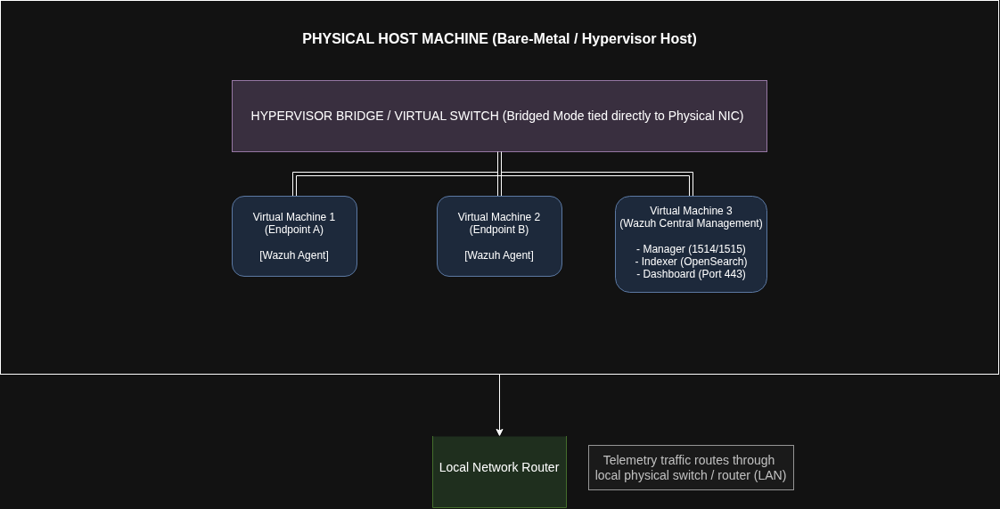
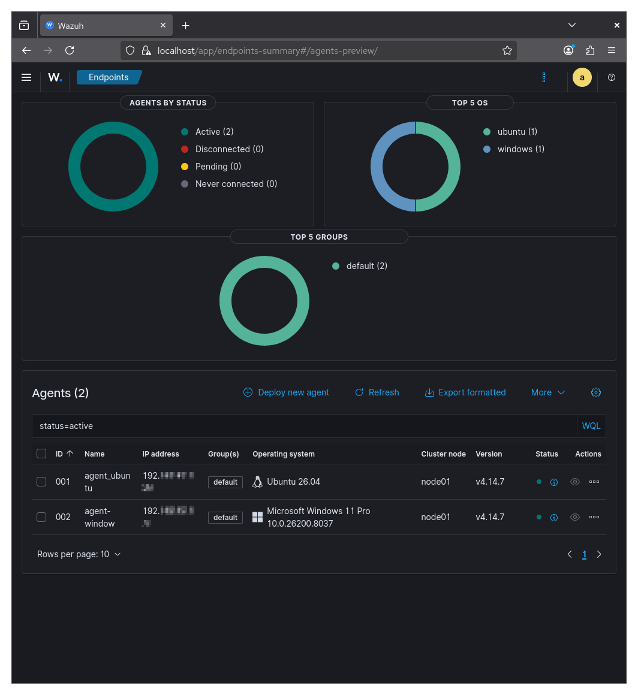
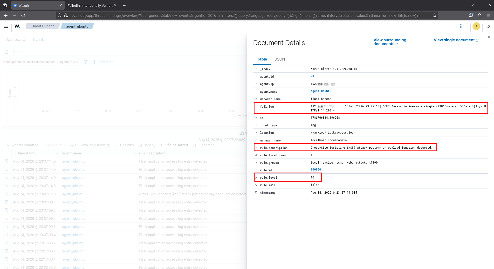
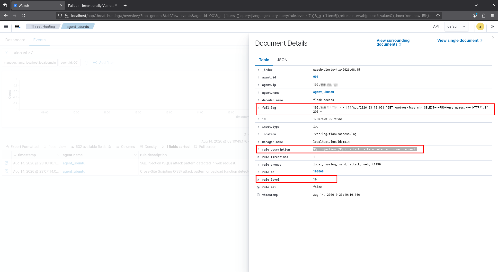
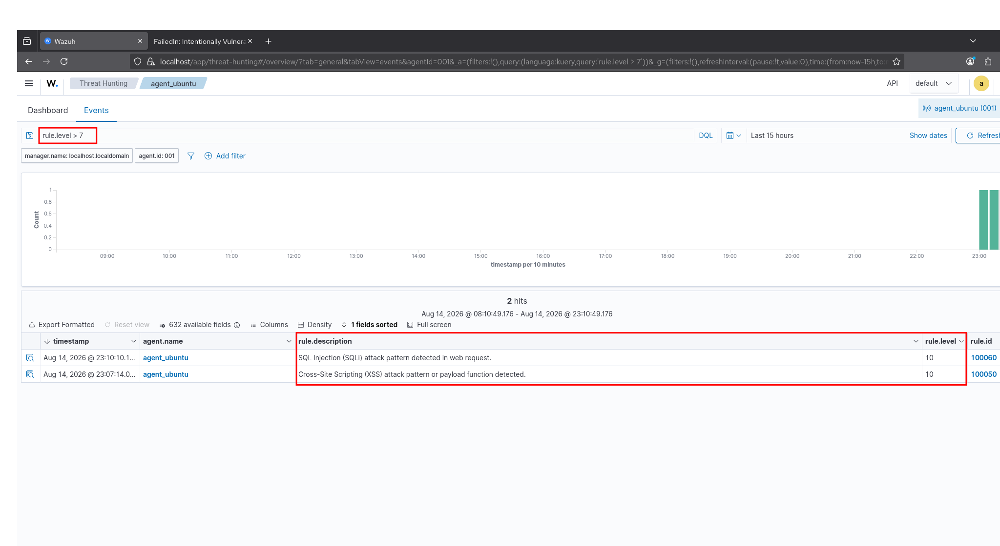

# Technical Build Guide


## Setting Up Virtual Machines (VMs)

The genesis of this project was the scaffolding of three virtual machines which would each represent part of a enterprise environment. It was decided that two VMs would be Linux based and one would be a Windows 11 machine. Considering the resources of the host machine it was important to choose Linux distributions which utilized few resources but were highly compatible with the XDR/SIEM of choice and other common security tools. 

Thus **Ubuntu** was chosen as an endpoint device (Endpoint A) housing the vulnerable web application and **CentOS** would be the central management server for the XDR/SIEM. **Windows 11** was also chosen to be a monitored endpoint device (Endpoint B). It should be noted that each Endpoint was configured to maintain a static IP address to ensure the reliability of network communications between agents and the central management service.

### Virtual Machine Specifications 

| Operating System | RAM  | Storage |
| ---------------- | ---- | ------- |
| Ubuntu           | 4GB  | 20GB    |
| Windows 11       | 4GB  | 64GB    |
| CentOS           | 10GB | 75GB    |



## XDR/SIEM Scaffolding

Since the objective of this experiment includes the creation of a XDR/SIEM Detection environment it was imperative to choose an appropriate XDR/SIEM solution. In the previous section the desire to have a Windows 11 machine as a endpoint and CentOs as the central management server was expressed therefore Microsoft Defender/Sentinel was ruled out as a possible solution. That left Splunk and Wazuh. At the time of writing Splunk is a limited free SIEM solution. Despite having meaningful experience with Splunk this would not be acceptable for what is trying to be achieved in this experiment. 

This left [Wazuh](https://wazuh.com/), an open source solution that "unifies XDR and SIEM protection by collecting deep endpoint telemetry, network logs, and cloud data into a single rule engine for cross-domain correlation and automated response". It was not only promising but would deliver the functionality needed at no cost.

### Deploying Agents

The creation and deployment of agents was surprisingly straightforward and intuitive. The steps for both Linux and Windows based Wazuh agents were effectively identical: 

1. Choose the OS that the agent is being deployed (Linux/Windows/Mac).
2. Enter the host IP address of the Wazuh Manager.
3. (Optional) Give the agent a unique name.
4. Run the provided commands on the endpoint server. 

Once both were complete the agents could be observed within the Wazuh Central Management Dashboard along with the logs and telemetry collected from both endpoints. The status of the agents could also be seen (e.g. Connected or Disconnected). Another option for checking the status of agents is by running the following commands on their respective command lines:

```
systemctl status wazuh-agent ## Linux
sc query wazuh-agent         ## Windows   
```

> Note: For Linux agents it is recommended by Wuzuh to disable updates to the Wazuh repository to prevent accidental upgrades. This is because compatibility between the agent and manager is "guaranteed" when the manager version is later than or equal to that of the agent.



## Deploying Vulnerable Application on Endpoint A

In this phase the intentionally vulnerable web application I had previously developed was deployed to the Ubuntu endpoint. Here it will be tested against for the purpose of simulating a live enterprise web application. 

The script for executing the application was slightly altered to force it to run on 0.0.0.0 so it could be accessed by the greater local network.

```bash
uv run flask --app main run --host=0.0.0.0 --port=5000 > /var/log/flask/access.log 2>&1 &
```


## Setting Up Rules and Decoder for Flask logs

The vulnerable web application running is great however its logs need to be accessible in order to fulfill the purpose of this experiment. The next step was to alter the vulnerable web application to write logs to a file on the server and make sure that the user space for the wazuh manager had permission to read and access the log file and directory it is saved within.

Raw flask logs are not natively supported by Wazuh so it was required to create a decoder which will hold a regex that identified the Flask HTTP logs. Rules were also created/defined to trigger alerts for Flask event logs. 

```xml
 <rule id="100002" level="3">
    <decoded_as>flask-access</decoded_as>
    <description>Flask application access log entry detected.</description>
 </rule>
```

Once created and saved the next step was to test the decoder with the native **wazuh-logtest** found in `/var/ossec/bin/wazuh-logtest`. It requires a sample to test the decoder against. This was obtained from the running app with the following command: 

```bash
tail -n 1 /var/log/flask/access.log
```

Once the test passed all that was left was to restart the manager: 

```bash
systemctl restart wazuh-manager
```

Additionally specific rules were created to catch generic 404 and 500 errors along with common injection attacks such as Cross Site Scripting and SQL Injection (SQLi) under their own respective ids.

```xml
  <!-- Catch 404 Page Not Found Errors -->
  <rule id="100003" level="5">
    <if_sid>100002</if_sid>
    <id>^404</id>
    <description>Flask App: Page Not Found (404 Error).</description>
    <group>web,app_vulnerability,</group>
  </rule>

  <!-- Catch 500 Internal Server Errors -->
  <rule id="100004" level="8">
    <if_sid>100002</if_sid>
    <id>^500</id>
    <description>Flask App: Internal Server Error (500 Crash).</description>
    <group>web,service_error,</group>
  </rule>
```


```xml
<!-- Catch Potential XSS Attack -->
  <rule id="100050" level="10">
    <if_sid>100002</if_sid>
    <match type="pcre2">(?i)(?:%3C|&lt;)script(?!%3E|&gt;)[^&gt;]*(?:%3E|&gt;)|javascript\s*:|(?:alert|print|console)\s*\(.*?\)</match>
    <description>Cross-Site Scripting (XSS) attack pattern or payload function detected.</description>
    <group>web,attack,t1190,</group>
  </rule>

<!-- Catch Potential SQLi Attack -->
  <rule id="100060" level="10">
    <if_sid>100002</if_sid>
    <regex type="pcre2">(?i)\s+union\s+(all\s+)?select|/\*.*?\*/|'?\s*or\s+[^=]+=\s*[^=\s]+|'?\s*or\s+'[^']+'\s*=\s*'[^']+'|--|\s+drop\s+table|\s+insert\s+into</regex>
    <description>SQL Injection (SQLi) attack pattern detected in web request.</description>
    <group>attack,web,t1190,</group>
  </rule>
```


## Analyzing Logs and Running Attacks Against Endpoints

Once logs were being ingested by the agent from the Flask application I proceeded to run manual attacks against the web application from a separate VM. The first of which was a Reflective Cross Site Scripting attack (XSS). 

After waiting a minute for the logs to propagate, I navigated to the **Wazuh Threat Intelligence** dashboard and searched the **Events** for the attack:

```
full_log="
```



Alerting rules were tested for other injection attacks that were carried out such as SQLi. As expected they were also caught by the agent:



In addition to searching for specific attacks it is also possible to search/filter through the Threat Hunting logs by rule levels. The following query can be executed to find both the SQLi and XSS attacks:

```
rule.level > 7
```



Tests for benign 404 errors was conducted to see if these rules were being picked up as well. Searching for a 404 error returned the expected log: 

```bash
192.x.x.x - - [14/Aug/2026 22:17:35] "GET /testnotfound HTTP/1.1" 404 -
```

